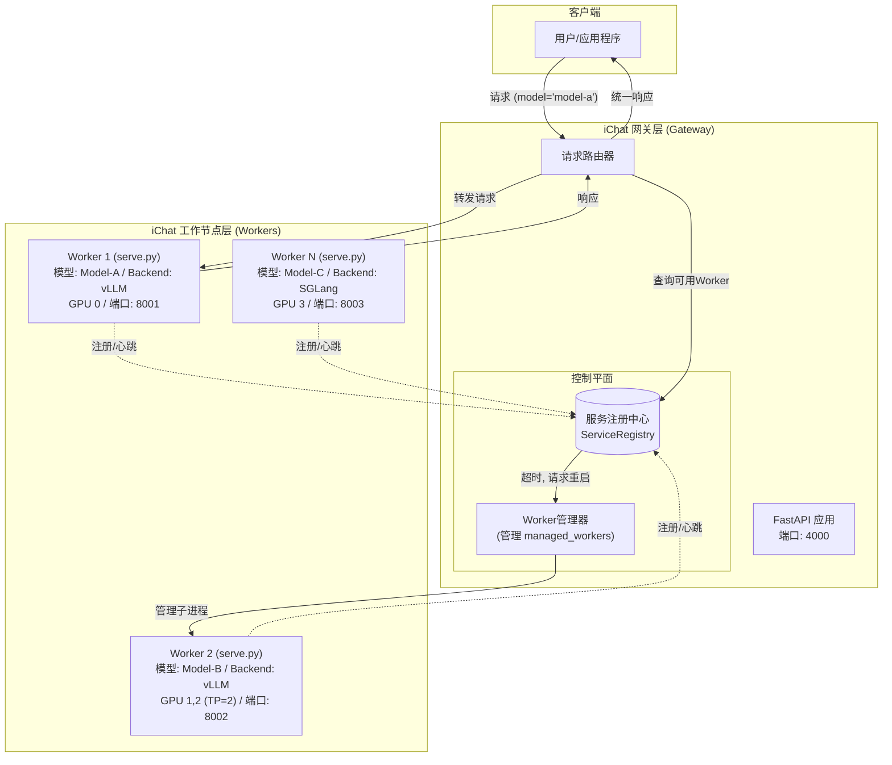

# iChat: 分离式网关与工作节点（Worker）推理服务框架

iChat 是一个专为大型语言模型（LLM）设计的高性能、可扩展的推理服务框架。它采用**网关（Gateway）与工作节点（Worker）分离**的现代化架构，通过统一的API网关和多个独立的模型服务工作节点，实现了对异构推理后端（如vLLM, SGLang）的集中管理和动态路由。

## 核心特性

- **分离式架构**: 包含两大组件：`iChat Gateway` 负责请求路由、负载均衡和统一API入口；`iChat Worker` 负责加载和运行单个模型实例。
- **统一API网关**: 客户端只需与Gateway交互，即可访问所有后端模型服务，无需关心其具体部署位置和端口。
- **多引擎支持**: Worker节点可独立选择`vLLM`或`SGLang`作为推理引擎，并通过Gateway进行统一管理。
- **动态模型路由**: Gateway根据客户端请求的`model`字段，将流量动态路由到正确的Worker实例。
- **灵活部署**: 支持从单机单卡到多机多卡的任意复杂部署场景。Worker节点可以灵活分布，充分利用硬件资源。
- **混合部署模式**: Gateway可同时管理通过配置文件启动的Worker（`managed_workers`），并接受外部Worker的动态注册。两种方式无缝集成，提供极致的部署灵活性。
- **服务发现与自愈**: Worker向Gateway自动注册并发送心跳。Gateway通过健康检查自动剔除故障节点，并能自动重启由它管理的`managed_worker`，实现服务自愈。
- **非侵入式设计**: Worker与底层推理引擎完全解耦，集成新引擎无需修改核心代码。
- **资源精细化控制**: 通过 `CUDA_VISIBLE_DEVICES` 环境变量，可为每个Worker实例精确分配物理GPU。
- **参数透传**: 保留对各引擎特定参数的直接访问能力，实现高级定制化。
- **集中式日志管理**: Worker通过SSE实时流式传输日志到Gateway，实现集中式日志收集与监控。

## 系统架构

iChat架构将系统拆分为两个核心部分：iChat Gateway和iChat Worker。Gateway作为系统的单一流量入口，负责接收所有客户端请求，并根据配置的路由规则，智能地将请求转发给后端相应的Worker。每个Worker是一个独立的`serve.py`实例，它加载一个模型并运行在一个或多个GPU上。

Gateway内部包含两大核心组件：
- **服务注册中心 (`ServiceRegistry`)**: 内存中的动态数据库，通过心跳机制跟踪所有Worker的健康状态、模型和地址，并实时更新路由表。
- **Worker管理器 (`WorkerManager`)**: 负责管理配置文件中定义的`managed_workers`的完整生命周期，包括启动、监控、终止和故障重启。



## 项目结构

```
docker-iei/ichat/
├── README.md            # 项目文档
├── gateway.py           # iChat Gateway 入口
├── serve.py             # Worker 入口
├── config.yaml.example  # Gateway 配置文件示例
├── doc                  # 产品设计文档
├── gateway/             # Gateway核心逻辑
│   ├── __init__.py
│   ├── api.py           # FastAPI应用、路由和生命周期管理
│   ├── registry.py      # 服务注册中心 (ServiceRegistry)
│   └── worker_manager.py # Worker进程管理器 (WorkerManager)
├── backends/             # 推理引擎的抽象和实现
│   ├── __init__.py
│   ├── base.py          # 基础引擎抽象类
│   ├── vllm_backend.py   # vLLM引擎实现
│   └── sglang_backend.py # SGLang引擎实现
├── config/              # 配置相关
│   ├── __init__.py
│   └── args.py          # Worker参数解析 (框架与后端分离)
├── utils/               # 工具函数
│   ├── __init__.py
│   ├── common.py        # 通用工具函数
│   └── logger.py        # 日志处理模块
└── monitor/             # 监控和服务发现
    ├── __init__.py
    └── heartbeat.py     # 心跳检测机制
```

## 设计原则

iChat的开发遵循以下核心原则：

1.  **关注点分离**: Gateway专注于网络路由、服务管理和API聚合，Worker专注于模型推理。
2.  **扩展性优先**: 通过配置文件驱动的动态路由机制，可以轻松地水平扩展Worker节点，以支持更多模型或提供更高吞吐量。
3.  **引擎解耦**: Worker与推理引擎（如vLLM, SGLang）完全解耦，方便未来快速扩展支持新的推理引擎。
4.  **动态配置驱动**: Gateway的核心行为，特别是模型路由表，是通过服务注册中心实时更新的，支持在不重启Gateway的情况下动态增删Worker和模型。
5.  **高可用与自愈**: 通过心跳机制，Gateway能持续监控Worker健康状况，自动隔离故障节点，并对`managed_worker`进行自动重启。
6.  **框架与后端参数分离**: `serve.py`只解析框架自身参数，将所有未知参数“透传”给后端处理。这使得后端可以自由地定义和使用任何参数，而无需修改框架代码。
7.  **设计驱动开发**: 所有重大架构变更和功能开发都首先在`doc/`目录下的设计文档中进行清晰的规划。

## 功能状态

| 模块 | 状态 | 说明 |
|------|------|------|
| **Gateway** | 开发中 | API网关，负责请求路由和Worker管理 |
| **Worker (`serve.py`)** | 已完成 | 负责加载并运行单个模型实例，实现了优雅的生命周期管理 |
| **服务注册与发现** | 已完成 | Worker可向Gateway自动注册并发送心跳 |
| **日志流传输** | 已完成 | Worker可通过SSE向Gateway实时流式传输日志 |
| **Worker生命周期管理** | 已完成 | 由`serve.py`实现独立的生命周期控制，并接受Gateway的管理 |
| 参数统一处理 | 已完成 | Worker实现了框架与后端参数的分离处理，支持统一参数与原生参数透传 |
| vLLM引擎适配 | 已完成 | vLLM作为后端引擎的深度集成与生命周期管理 |
| SGLang引擎适配 | 已完成 | SGLang作为后端引擎的深度集成与生命周期管理 |
| 手动多模型部署 | 已完成 | 支持通过启动多个Worker实例并由Gateway统一管理 |
| 分布式推理 | 待开发 | Worker支持单机/多机分布式。多机模式需手动建立Ray集群。|
| 多模态支持 | 待开发 | 图像、音频等多模态能力 |
| Embedding支持 | 待开发 | 文本嵌入模型支持 |
| Rerank支持 | 待开发 | 重排模型支持 |


## 使用说明

iChat采用统一的混合部署模型，启动Gateway后，可以通过多种方式部署和连接Worker。

### 步骤1：配置并启动Gateway

首先，配置并启动Gateway服务。它将作为系统的中央控制点和统一API入口。

**1. 目录结构**

为确保Python模块能被正确导入，请在`ichat`目录的**父目录**下执行所有命令。

```
/app/
└── ichat/
    ├── gateway.py
    ├── serve.py
    ├── config.yaml
    └── ...
```

**2. 创建配置文件 (`ichat/config.yaml`)**

**`config.yaml` 示例:**
```yaml
# Gateway服务配置
server_settings:
  host: 0.0.0.0
  port: 4000
  log_level: info
  heartbeat_timeout: 30 # worker心跳超时时间(秒)

# Gateway自动管理的Worker配置
# Gateway会根据此列表自动启动和管理Worker进程
managed_workers:
  - model_name: qwen-7b-chat
    model_path: /path/to/qwen-7b-chat
    backend: vllm
    gpu_ids: [0]
    port: 8001
    heartbeat_interval: 10
    # 以下为透传给 vLLM 的后端专属参数
    tensor_parallel_size: 1
    gpu_memory_utilization: 0.9
```

**3. 启动Gateway**

在`ichat`的父目录中（例如`/app`），使用以下命令启动Gateway。Gateway会读取配置文件，自动启动`managed_workers`中定义的Worker，并开始监听来自外部Worker的注册请求。

```bash
# 在 /app 目录下执行
python3 -m ichat.gateway --config ichat/config.yaml
```

### 步骤2：部署Worker

您可以根据需求，选择以下一种或多种方式来部署模型服务。

#### 方式一：由Gateway自动管理

如果您希望Gateway为您管理Worker的生命周期（启动、监控、重启），只需在`config.yaml`的`managed_workers`部分定义好Worker即可。Gateway启动时会自动拉起这些服务。此方式适合需要集中管理和部署的场景。

#### 方式二：手动启动Worker并动态注册

在任何可以访问Gateway的机器上，您都可以手动启动Worker。Worker会自动向Gateway注册自己，并纳入Gateway的路由表中。此方式适合分布式部署或需要手动精细控制Worker启动的场景。

**启动命令 (在`ichat`父目录下执行):**
```bash
PARENT_DIR=... # ichat的父目录
cd $PARENT_DIR

# Worker 1: 在GPU 0上部署model-a
CUDA_VISIBLE_DEVICES=0 python3 -m ichat.serve \
  --model-path /path/to/model_A \
  --served-model-name model-a \
  --port 8001 \
  --gateway-address http://<GATEWAY_HOST>:4000

# Worker 2: 在GPU 1,2上部署large-model-b (TP=2)
CUDA_VISIBLE_DEVICES=1,2 python3 -m ichat.serve \
  --model-path /path/to/large_model_B \
  --served-model-name large-model-b \
  --port 8002 \
  --tensor-parallel-size 2 \
  --gateway-address http://<GATEWAY_HOST>:4000
```

每个Worker启动后会：
1. 向Gateway的`/v1/workers/heartbeat`接口发送注册请求和周期性心跳。
2. 定期发送心跳以表明自己处于活动状态。
3. （可选）通过SSE接口实时流式传输日志到Gateway。

### 步骤3：发送请求

无论采用哪种部署方式，客户端都只需与Gateway交互。所有请求都应发送到Gateway的地址（例如`http://localhost:4000`）。

```bash
curl http://localhost:4000/v1/chat/completions \
  -H "Content-Type: application/json" \
  -d '{
    "model": "qwen-14b-chat",
    "messages": [
      {"role": "user", "content": "你好"}
    ]
  }'
```

Gateway会根据请求中的`model`字段，查询其服务注册表（包含所有自动管理的和动态注册的路由），然后将请求路由到相应的Worker。

## API 规范

iChat Gateway API 分为数据平面和控制平面。

### 1. 数据平面 API (OpenAI 兼容, 面向客户端)

- `POST /v1/chat/completions`
  - **功能**: 接收聊天补全请求，根据 `model` 字段路由到合适的 Worker。
- `GET /v1/models`
  - **功能**: 返回所有处于 `ready` (已就绪) 状态的 Worker 所对应的模型列表，提供准确的服务可用性视图。

### 2. 控制平面 API (面向 Worker 和管理员)

##### i. Worker-Gateway 交互接口

- `POST /v1/workers/heartbeat`
  - **功能**: Worker 使用此接口进行首次注册和后续的周期性心跳。Gateway 根据心跳包中的 `state` 字段执行相应操作，并强制确保模型名称的唯一性。
  - **请求体**:
    ```json
    {
      "worker_id": "unique-worker-id-123",
      "model_name": "qwen-7b-chat",
      "model_path": "/path/to/qwen-7b-chat",
      "backend": "vllm",
      "host": "192.168.1.10",
      "port": 8001,
      "state": "initializing"
    }
    ```
  - **响应**:
    - `200 OK`: 心跳被成功接收和处理。
    - `409 Conflict`: 注册失败，因为请求的 `model_name` 已经被另一个活跃的 Worker 占用。
  - **状态 (`state`) 字段详解**:
    - `initializing` / `ready`: Worker 尝试注册或更新心跳。Gateway 会执行**冲突检测**：如果模型名已被一个活跃 Worker 占用，则拒绝注册；如果被一个正在终止 (`terminating`) 的 Worker 占用，则允许注册并替换掉旧 Worker。
    - `terminating`: Worker 正在优雅关闭。Gateway 会根据其是 `managed` 还是 `dynamic` 类型来执行不同的处理逻辑（例如，为 `managed` 类型触发重启）。

##### ii. 管理员接口 (部分接口正在开发中)

- `GET /v1/admin/workers`
  - **功能**: 列出所有已注册的 Worker（包括 `managed` 和 `dynamic` 类型）及其详细状态。

- `GET /v1/admin/workers/{worker_id}`
  - **功能**: 获取指定 Worker 的详细信息。

- `POST /v1/admin/workers/launch`
  - **功能**: 动态启动一个新的 Worker 进程。
  - **请求体**: 定义新 Worker 的完整配置。

- `DELETE /v1/admin/workers/{worker_id}`
  - **功能**: 停止并移除一个由 Gateway 启动的 Worker 实例。

- `GET /v1/admin/cluster/status`
  - **功能**: 获取整个 iChat 集群的总体状态概览。

- `GET /v1/admin/cluster/version`
  - **功能**: 获取 iChat Gateway 的版本信息。


## 贡献

欢迎贡献代码、报告问题或提出改进建议：

1. Fork项目仓库
2. 创建功能分支: `git checkout -b feature/new-feature`
3. 提交更改: `git commit -m 'Add new feature'`
4. 推送分支: `git push origin feature/new-feature`
5. 提交合并请求

## 许可证

本项目采用MIT许可证 - 详见LICENSE文件
