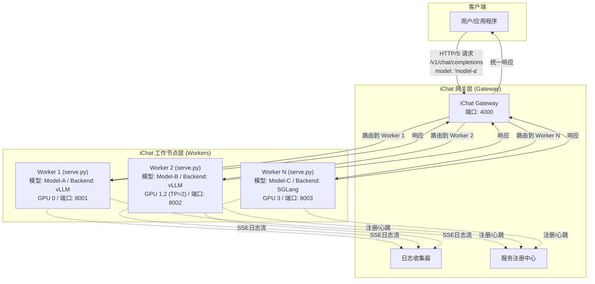

# iChat: 分离式网关与工作节点（Worker）推理服务框架

iChat 是一个专为大型语言模型（LLM）设计的高性能、可扩展的推理服务框架。它采用**网关（Gateway）与工作节点（Worker）分离**的现代化架构，通过统一的API网关（基于 `LiteLLM`）和多个独立的模型服务工作节点，实现了对异构推理后端（如vLLM, SGLang）的集中管理和动态路由。

## 核心特性

- **分离式架构**: 包含两大组件：`iChat Gateway` 负责请求路由、负载均衡和统一API入口；`iChat Worker` 负责加载和运行单个模型实例。
- **统一API网关**: 客户端只需与Gateway交互，即可访问所有后端模型服务，无需关心其具体部署位置和端口。
- **多引擎支持**: Worker节点可独立选择`vLLM`或`SGLang`作为推理引擎，并通过Gateway进行统一管理。
- **动态模型路由**: Gateway根据配置文件动态地将请求路由到指定的Worker，轻松实现模型的增、删、改，无需重启服务。
- **灵活部署**: 支持从单机单卡到多机多卡的任意复杂部署场景。Worker节点可以灵活分布，充分利用硬件资源。
- **混合部署模式**: Gateway可同时管理通过配置文件启动的Worker，并接受外部Worker的动态注册。两种方式无缝集成，提供极致的部署灵活性。
- **非侵入式设计**: Worker与底层推理引擎完全解耦，集成新引擎无需修改核心代码。
- **资源精细化控制**: 通过 `CUDA_VISIBLE_DEVICES` 环境变量，可为每个Worker实例精确分配物理GPU。
- **参数透传**: 保留对各引擎特定参数的直接访问能力，实现高级定制化。
- **自动服务发现**: Worker可自动向Gateway注册并定期发送心跳，实现动态服务发现。
- **集中式日志管理**: Worker通过SSE实时流式传输日志到Gateway，实现集中式日志收集与监控。

## 系统架构

iChat架构将系统拆分为两个核心部分：iChat Gateway和iChat Worker。Gateway作为系统的单一流量入口，负责接收所有客户端请求，并根据配置的路由规则，智能地将请求转发给后端相应的Worker。每个Worker是一个独立的`serve.py`实例，它加载一个模型并运行在一个或多个GPU上。

这种设计将网络路由与模型计算彻底分离，极大地提升了系统的灵活性、可维护性和扩展性。



## 项目结构

```
docker-iei/ichat/
├── README.md            # 项目文档
├── gateway.py           # iChat Gateway 入口
├── serve.py             # Worker 入口
├── config.yaml.example  # Gateway 配置文件示例
├── doc                  # 产品设计文档
├── backends/             # 推理引擎的抽象和实现
│   ├── __init__.py
│   ├── base.py          # 基础引擎抽象类
│   ├── vllm_backend.py   # vLLM引擎实现
│   └── sglang_backend.py # SGLang引擎实现
├── config/              # 配置相关
│   ├── __init__.py
│   └── args.py          # Worker参数处理和转换
├── utils/               # 工具函数
│   ├── __init__.py
│   ├── common.py        # 通用工具函数
│   └── logger.py        # 日志处理模块
└── monitor/             # 监控和服务发现
    ├── __init__.py
    ├── registry.py      # 服务注册中心
    └── heartbeat.py     # 心跳检测机制
```

## 设计原则

iChat的开发遵循以下核心原则：

1.  **关注点分离**: Gateway负责网络路由和管理，Worker专注于模型推理。各组件职责清晰，易于独立开发和维护。
2.  **扩展性优先**: 通过配置文件驱动的动态路由机制，可以轻松地水平扩展Worker节点，以支持更多模型或提供更高吞吐量。
3.  **引擎解耦**: Worker与推理引擎（如vLLM, SGLang）完全解耦，方便未来快速扩展支持新的推理引擎。
4.  **vLLM为默认引擎**: Worker默认采用vLLM，用户可通过`--backend`参数显式指定。
5.  **统一参数标准**: Worker的核心参数以vLLM为基准（snake_case），iChat内部会自动映射到其他引擎的格式。
6.  **设计驱动开发**: 所有重大架构变更和功能开发都首先在`README.md`中进行清晰的设计和规划。
7.  **集中式管理**: Gateway作为中心控制点，可以集中管理所有Worker的生命周期和资源分配。
8.  **自愈能力**: 通过心跳机制，系统能够自动检测和处理Worker节点故障。

## 功能状态

| 模块 | 状态 | 说明 |
|------|------|------|
| **Gateway** | 待开发 | API网关，基于LiteLLM，负责请求路由 |
| **Worker (`serve.py`)** | 待开发 | 负责加载并运行单个模型实例 |
| **服务注册与发现** | 待开发 | Worker向Gateway注册并发送心跳的机制 |
| **日志流传输** | 待开发 | Worker通过SSE向Gateway传输日志 |
| **Worker生命周期管理** | 待开发 | Gateway管理Worker的启动、监控和关闭 |
| 参数统一处理 | 待开发 | Worker的命令行参数解析与转换 |
| vLLM引擎适配 | 待开发 | vLLM推理引擎在Worker中的集成 |
| SGLang引擎适配 | 待开发 | SGLang推理引擎在Worker中的集成 |
| 手动多模型部署 | 待开发 | 通过启动多个Worker实例并由Gateway管理实现 |
| 分布式推理 | 待开发 | Worker支持单机/多机分布式。多机模式需手动建立Ray集群。|
| 多模态支持 | 待开发 | 图像、音频等多模态能力 |
| Embedding支持 | 待开发 | 文本嵌入模型支持 |
| Rerank支持 | 待开发 | 重排模型支持 |


## 使用说明

iChat采用统一的混合部署模型，启动Gateway后，可以通过多种方式部署和连接Worker。

### 步骤1：配置并启动Gateway

首先，启动Gateway服务，它将作为系统的中央控制点和统一API入口。

**1. 创建配置文件**

创建一个`config.yaml`文件，定义Gateway的行为以及它需要管理的Worker和外部路由。

**`config.yaml` 示例:**
```yaml
# Gateway服务配置
server_settings:
  host: 0.0.0.0
  port: 4000
  log_level: info

# Gateway自动管理的Worker配置
# Gateway会根据此列表自动启动和管理Worker进程
managed_workers:
  - model_name: qwen-7b-chat
    model_path: /path/to/qwen-7b-chat
    backend: vllm
    gpu_ids: [0]
    port: 8001
    heartbeat_interval: 3
    tensor_parallel_size: 1
    gpu_memory_utilization: 0.9
    
  - model_name: qwen-14b-chat
    model_path: /path/to/qwen-14b-chat
    backend: vllm
    gpu_ids: [1, 2]
    port: 8002
    heartbeat_interval: 3
    tensor_parallel_size: 2

# LiteLLM设置
litellm_settings:
  drop_params: True
```

**2. 启动Gateway**

使用以下命令启动Gateway。Gateway会读取配置文件，自动启动`managed_workers`中定义的Worker，并监听来自外部Worker的注册请求。

```bash
python gateway.py --config config.yaml
```

### 步骤2：部署Worker

您可以根据需求，选择以下一种或多种方式来部署模型服务。

#### 方式一：由Gateway自动管理

如果您希望Gateway为您管理Worker的生命周期（启动、监控、重启），只需在`config.yaml`的`managed_workers`部分定义好Worker即可。Gateway启动时会自动拉起这些服务。此方式适合需要集中管理和部署的场景。

#### 方式二：手动启动Worker并动态注册

在任何可以访问Gateway的机器上，您都可以手动启动Worker。Worker会自动向Gateway注册自己，并纳入Gateway的路由表中。此方式适合分布式部署或需要手动精细控制Worker启动的场景。

```bash
# Worker 1: 在GPU 0上部署model-a
CUDA_VISIBLE_DEVICES=0 python serve.py \
  --model /path/to/model_A \
  --port 8001 \
  --backend vllm \
  --gateway-address http://<GATEWAY_HOST>:4000 \
  --model-name model-a-dynamic

# Worker 2: 在GPU 1,2上部署large-model-b
CUDA_VISIBLE_DEVICES=1,2 python serve.py \
  --model /path/to/large_model_B \
  --port 8002 \
  --tensor-parallel-size 2 \
  --gateway-address http://<GATEWAY_HOST>:4000 \
  --model-name large-model-b-dynamic
```
*请注意：`--gateway`参数已更新为`--gateway-address`以提高清晰度。*

每个Worker启动后会：
1. 向Gateway的`/register`接口发送注册请求。
2. 定期发送心跳以表明自己处于活动状态。
3. 通过SSE接口实时流式传输日志到Gateway。

### 步骤3：发送请求

无论采用哪种部署方式，客户端都只需与Gateway交互。所有请求都应发送到Gateway的地址（例如`http://localhost:4000`）。

```bash
curl http://localhost:4000/v1/chat/completions \
  -H "Content-Type: application/json" \
  -d '{
    "model": "qwen-14b-chat",
    "messages": [
      {"role": "user", "content": "你好"}
    ]
  }'
```

Gateway会根据请求中的`model`字段，查询其服务注册表（包含所有自动管理的和动态注册的路由），然后将请求路由到相应的Worker。

## API 规范

iChat 的 API 分为两层：**Gateway API** 和 **Worker API**。客户端和管理员与 Gateway 交互，Gateway 与 Worker 交互。

```
+----------+      +------------------+      +---------------+
|          |----->|                  |----->|               |
|  Client  |      |  iChat Gateway   |      |  iChat Worker |
|          |<-----|                  |<-----|               |
+----------+      +------------------+      +---------------+
     ^                     ^
     |                     |
     +------(Admin)--------+
```

### 1. iChat Worker API (`serve.py`)

Worker 是实际的模型服务实例，其 API 主要由 Gateway 调用。

#### a. 数据平面 API (OpenAI 标准兼容)

Worker 包装了底层推理引擎（如 vLLM, SGLang），并向上层（Gateway）暴露标准的 OpenAI API 接口。

- `POST /v1/chat/completions`: 接收聊天补全请求。Gateway 会将客户端的请求直接转发至此。
- `POST /v1/completions`: 接收文本补全请求（传统接口）。
- `POST /v1/embeddings`: 接收文本嵌入请求。
- `GET /v1/models`: 返回此 Worker 加载的模型的详细信息。

#### b. 控制平面 API

这些接口供 Gateway 用于监控和管理 Worker。

- `GET /health`
  - **功能**: 健康检查接口。Gateway 使用此接口进行存活性和就绪性探测，确保 Worker 可以接收流量。
  - **响应**: `{"status": "ok"}`
- `GET /metrics`
  - **功能**: 暴露 Prometheus 格式的性能指标。可用于监控推理延迟、吞吐量、GPU 使用率等。
- `GET /logs/stream`
  - **功能**: 通过 Server-Sent Events (SSE) 向上游（Gateway）提供实时日志流。Gateway 连接此端点以实现集中式日志收集。

### 2. iChat Gateway API

Gateway 是整个系统的统一入口，为客户端和管理员提供服务。

#### a. 数据平面 API (OpenAI 兼容)

Gateway 聚合了所有 Worker 的能力，并提供一个统一的 OpenAI 兼容入口。

- `POST /v1/chat/completions`: 接收客户端的聊天补全请求，并根据 `model` 字段路由到合适的 Worker。
- `POST /v1/completions`: (传统接口) 接收文本补全请求并路由。
- `POST /v1/embeddings`: 接收文本嵌入请求并路由。
- `GET /v1/models`: 聚合所有已注册的、健康的 Worker 的模型信息，并返回一个统一的模型列表。
- `GET /v1/models/{model_name}`: 获取特定模型的详细信息。

#### b. 控制平面 API

控制平面 API 分为两部分：供 Worker 注册的内部接口和供管理员使用的管理接口。

##### i. Worker-Gateway 交互接口

这些接口由 Worker 主动调用，用于服务发现和状态上报。

- `POST /v1/workers/heartbeat`
  - **功能**: Worker 启动后，定期向 Gateway 发送心跳。此接口同时处理 **首次注册** 和 **后续心跳**。
  - **模式**: 采用 "upsert" 逻辑。如果 `worker_id` 首次出现，则视为注册；如果已存在，则更新其状态。
  - **请求体**: 包含 Worker 的完整元数据，如 `worker_id` (由 Worker 自行生成), `model_name`, `backend`, `host`, `port`, `model_path` 等。
  - **设计理念**: 简化 Worker 实现，无需区分注册和心跳流程。

- `GET /v1/logs/stream/{worker_id}`
  - **功能**: Worker 通过 SSE (Server-Sent Events) 将日志实时流式传输到 Gateway，以实现集中式日志管理。

##### ii. 管理员接口

这些接口用于监控和管理整个 iChat 集群。

- `GET /v1/admin/workers`
  - **功能**: 列出所有已注册的 Worker（包括由 Gateway 管理的和动态注册的），并显示其状态（如 `healthy`, `unhealthy`）、模型、地址等信息。

- `GET /v1/admin/workers/{worker_id}`
  - **功能**: 获取指定 Worker 的详细信息，包括元数据和健康状态。

- `POST /v1/admin/workers/launch`
  - **功能**: 动态启动一个新的 Worker 进程。此功能适用于通过 Gateway 按需扩展 Worker 的场景。
  - **请求体**: 包含启动 Worker 所需的完整配置，如 `model_name`, `model_path`, `backend`, `host`, `port`, `gpu_ids`, `heartbeat_interval` 等。

- `DELETE /v1/admin/workers/{worker_id}`
  - **功能**: 停止并移除一个由 Gateway 启动的 Worker 实例。

- `GET /v1/admin/cluster/status`
  - **功能**: 获取整个 iChat 集群的总体状态，包括 Gateway 状态、资源使用情况和已注册 Worker 概览。

- `GET /v1/admin/cluster/version`
  - **功能**: 获取 iChat Gateway 的版本信息。


## Worker (`serve.py`) 参数详解

`serve.py` 封装了 `vLLM` 的推理服务。除了 `iChat` 的特定参数外，它还支持所有 `vLLM` OpenAI API 服务的启动参数。

### iChat 特定参数

这些参数用于配置Worker与Gateway的交互。

| 参数 | 缩写 | 描述 | 默认值 |
|---|---|---|---|
| --backend | -be | 推理后端类型 (vllm/sglang) | `vllm` |
| --gateway-address | -ga | Gateway的地址，用于自动注册和心跳 | `-` |
| --served-model-name | -n | 在Gateway中注册的模型名称 | `-` |
| --heartbeat-interval | --hi | 向Gateway发送心跳的间隔（秒） | `30` |
| --log-streaming | --ls | 是否启用向Gateway的实时日志流 | `True` |

### 附录A: SGLang 引擎参数

当 `backend` 为 `sglang` 时，`backend_args` 对象可以包含所有传递给 SGLang 的启动参数。Gateway 会接收并存储所有这些参数，以便于监控和管理。以下是按功能划分的常用参数列表。

#### 模型与端口 (Model and Port)

| 参数 | 缩写 | 描述 | 默认值 |
|---|---|---|---|
| `--model-path` | `--model` | 模型权重的路径。可以是本地文件夹或 Hugging Face 仓库 ID。 | (必须) |
| `--tokenizer-path` | | Tokenizer 的路径。 | `None` (若未提供，则使用 `model_path`) |
| `--host` | | HTTP 服务器的主机地址。 | `127.0.0.1` |
| `--port` | | HTTP 服务器的端口号。 | `30000` |
| `--nccl-port` | | NCCL 分布式环境设置的端口。 | `None` (随机端口) |
| `--tokenizer-mode` | | Tokenizer 模式。'auto' 会使用快速 tokenizer (如果可用)，'slow' 则总是使用慢速 tokenizer。 | `auto` |
| `--skip-tokenizer-init` | | 如果设置，则跳过 tokenizer 初始化，并在生成请求中传递 input_ids。 | `False` |
| `--skip-server-warmup` | | 如果设置，则跳过预热。 | `False` |
| `--load-format` | | 要加载的模型权重格式。 | `auto` |
| `--model-loader-extra-config`| | 模型加载器的额外配置。 | `{}` |
| `--trust-remote-code` | | 是否允许 Hub 上的自定义模型在其自己的建模文件中定义。 | `False` |
| `--dtype` | | 模型权重和激活的数据类型。 | `auto` |
| `--kv-cache-dtype` | | KV 缓存存储的数据类型。'auto' 将使用模型数据类型。 | `auto` |
| `--quantization` | | 量化方法。 | `None` |
| `--quantization-param-path`| | 包含 KV 缓存缩放因子的 JSON 文件路径。 | `None` |
| `--context-length` | | 模型的最大上下文长度。 | `None` (使用模型 config.json 中的值) |
| `--device` | | 使用的设备 ('cuda', 'xpu', 'hpu', 'npu', 'cpu')。 | `auto` |
| `--served-model-name` | | 覆盖 OpenAI API 服务器中 v1/models 端点返回的模型名称。 | `None` (使用 `model_path`) |
| `--chat-template` | | 内置聊天模板名称或聊天模板文件的路径。 | `None` |
| `--completion-template` | | 内置补全模板名称或补全模板文件的路径。 | `None` |
| `--is-embedding` | | 是否将 CausalLM 用作嵌入模型。 | `False` |
| `--enable-multimodal` | | 为所服务模型启用多模态功能。 | `None` |
| `--revision` | | 要使用的特定模型版本。 | `None` |
| `--impl` | | 使用哪个模型实现。 | `auto` |

#### 内存与调度 (Memory and Scheduling)

| 参数 | 缩写 | 描述 | 默认值 |
|---|---|---|---|
| `--mem-fraction-static` | | 用于静态分配（模型权重和 KV 缓存内存池）的内存比例。 | `None` (自动计算) |
| `--max-running-requests`| | 最大运行中请求数。 | `None` |
| `--max-total-tokens` | | 内存池中的最大令牌数。 | `None` (根据内存比例自动计算) |
| `--chunked-prefill-size`| | 分块预填充中一个块的最大令牌数。 | `None` (根据 GPU 显存自动设置) |
| `--max-prefill-tokens` | | 预填充批次中的最大令牌数。 | `16384` |
| `--schedule-policy` | | 请求的调度策略。 | `fcfs` |
| `--schedule-conservativeness`| | 调度策略的保守程度。 | `1.0` |
| `--cpu-offload-gb` | | 为 CPU 卸载保留的 RAM GB 数。 | `0` |
| `--page-size` | | 一个页面中的令牌数。 | `1` |
| `--hybrid-kvcache-ratio`| | 统一和混合 kv 缓冲区之间的混合比例 [0,1]。 | `None` |

#### 其他运行时选项 (Other Runtime Options)

| 参数 | 缩写 | 描述 | 默认值 |
|---|---|---|---|
| `--tensor-parallel-size`| `--tp-size` | 张量并行大小。 | `1` |
| `--pipeline-parallel-size`| `--pp-size` | 流水线并行大小。 | `1` |
| `--max-micro-batch-size`| | 流水线并行中的最大微批次大小。 | `None` |
| `--stream-interval` | | 流式传输的间隔（或缓冲区大小），以令牌长度为单位。 | `1` |
| `--stream-output` | | 是否以不相交的段序列输出。 | `False` |
| `--random-seed` | | 随机种子。 | `None` (随机整数) |
| `--constrained-json-whitespace-pattern`| | JSON 约束输出中允许的语法空白的正则表达式模式。 | `None` |
| `--watchdog-timeout` | | 设置看门狗超时（秒）。 | `300` |
| `--dist-timeout` | | 设置 torch.distributed 初始化的超时时间。 | `None` |
| `--download-dir` | | huggingface 的模型下载目录。 | `None` |
| `--base-gpu-id` | | 开始分配 GPU 的基础 GPU ID。 | `0` |
| `--gpu-id-step` | | 使用的连续 GPU ID 之间的增量。 | `1` |
| `--sleep-on-idle` | | 当 sglang 空闲时减少 CPU 使用。 | `False` |

#### 日志 (Logging)

| 参数 | 缩写 | 描述 | 默认值 |
|---|---|---|---|
| `--log-level` | | 所有记录器的日志记录级别。 | `info` |
| `--log-level-http` | | HTTP 服务器的日志记录级别。 | `None` (使用 `--log-level`) |
| `--log-requests` | | 记录所有请求的元数据、输入、输出。 | `False` |
| `--log-requests-level`| | 请求日志的详细程度。0：元数据。1：元数据和采样参数。2：元数据、采样参数和部分输入/输出。3：所有输入/输出。 | `0` |
| `--crash-dump-folder` | | 崩溃前最后 5 分钟请求的转储文件夹路径。 | `None` |
| `--show-time-cost` | | 显示自定义标记的时间成本。 | `False` |
| `--enable-metrics` | | 启用 prometheus 指标日志。 | `False` |
| `--bucket-time-to-first-token`| | 首个 token 时间的桶。 | `None` |
| `--bucket-inter-token-latency`| | token 间延迟的桶。 | `None` |
| `--bucket-e2e-request-latency`| | 端到端请求延迟的桶。 | `None` |
| `--collect-tokens-histogram`| | 收集提示/生成 token 的直方图。 | `False` |
| `--kv-events-config` | | NVIDIA dynamo KV 事件发布的 json 格式配置。 | `None` |
| `--decode-log-interval` | | 解码批次的日志间隔。 | `40` |
| `--enable-request-time-stats-logging`| | 启用每个请求的时间统计日志记录。 | `False` |

#### API 相关 (API Related)

| 参数 | 缩写 | 描述 | 默认值 |
|---|---|---|---|
| `--api-key` | | 设置服务器的 API 密钥。 | `None` |
| `--file-storage-path` | | 后端文件存储的路径。 | `sglang_storage` |
| `--enable-cache-report` | | 在每个 openai 请求的 usage.prompt_tokens_details 中返回缓存的令牌数。 | `False` |
| `--reasoning-parser` | | 指定推理模型的解析器。 | `None` |
| `--tool-call-parser` | | 指定处理工具调用交互的解析器。 | `None` |

#### 数据并行 (Data Parallelism)

| 参数 | 缩写 | 描述 | 默认值 |
|---|---|---|---|
| `--data-parallel-size`| `--dp-size` | 数据并行大小。 | `1` |
| `--load-balance-method` | | 数据并行的负载均衡策略。 | `round_robin` |

#### 多节点分布式服务 (Multi-node Distributed Serving)

| 参数 | 缩写 | 描述 | 默认值 |
|---|---|---|---|
| `--dist-init-addr` | `--nccl-init-addr` | 用于初始化分布式后端的地址。 | `None` |
| `--nnodes` | | 节点数。 | `1` |
| `--node-rank` | | 节点排名。 | `0` |

#### 模型覆盖参数 (Model Override Args)

| 参数 | 缩写 | 描述 | 默认值 |
|---|---|---|---|
| `--json-model-override-args`| | 用于覆盖默认模型配置的 JSON 字符串格式字典。 | `{}` |
| `--preferred-sampling-params`| | 将在 /get_model_info 中返回的 json 格式采样设置。 | `None` |

#### LoRA

| 参数 | 缩写 | 描述 | 默认值 |
|---|---|---|---|
| `--lora-paths` | | LoRA 适配器列表。 | `None` |
| `--max-loras-per-batch` | | 一个运行批次的最大适配器数。 | `8` |
| `--lora-backend` | | 为多 LoRA 服务选择内核后端。 | `triton` |

#### 内核后端 (Kernel Backend)

| 参数 | 缩写 | 描述 | 默认值 |
|---|---|---|---|
| `--attention-backend` | | 为注意力层选择内核。 | `None` (自动选择) |
| `--sampling-backend` | | 为采样层选择内核。 | `None` (自动选择) |
| `--grammar-backend` | | 为语法引导解码选择后端。 | `xgrammar` |

#### 推测解码 (Speculative Decoding)

| 参数 | 缩写 | 描述 | 默认值 |
|---|---|---|---|
| `--speculative-algorithm` | | 推测解码算法。 | `None` |
| `--speculative-draft-model-path`| | 草稿模型权重的路径。 | `None` |
| `--speculative-num-steps`| | 在推测解码中从草稿模型采样的步数。 | `None` (自动选择) |
| `--speculative-eagle-topk`| | 在 eagle2 中每步从草稿模型采样的 token 数。 | `None` (自动选择) |
| `--speculative-num-draft-tokens`| | 在推测解码中从草稿模型采样的 token 数。 | `None` (自动选择) |
| `--speculative-accept-threshold-single`| | 如果草稿 token 在目标模型中的概率大于此阈值，则接受它。 | `1.0` |
| `--speculative-accept-threshold-acc`| | 草稿 token 的接受概率从其目标概率 p 提升到 min(1, p / threshold_acc)。 | `1.0` |
| `--speculative-token-map`| | 草稿模型的小词汇表的路径。 | `None` |
| `--mm-attention-backend`| | 设置多模态注意力后端。 | `None` |

#### Expert 并行 (Expert Parallelism)

| 参数 | 缩写 | 描述 | 默认值 |
|---|---|---|---|
| `--expert-parallel-size`| `--ep-size` | expert 并行大小。 | `1` |
| `--enable-ep-moe` | | 为 moe 启用 expert 并行。ep 大小等于 tp 大小。 | `False` |
| `--enable-flashinfer-moe`| | 为 Blackwell 上的 modelopt_fp4 量化启用 FlashInfer CUTLASS MoE 后端。 | `False` |
| `--enable-flashinfer-allreduce-fusion`| | 为 Add_RMSNorm 启用 FlashInfer allreduce 融合。 | `False` |
| `--enable-deepep-moe` | | 为 EP MoE 启用 DeepEP MoE 实现。 | `False` |
| `--deepep-mode` | | 启用 DeepEP MoE 时的模式选择。 | `auto` |
| `--ep-num-redundant-experts`| | 在 expert 并行中分配此数量的冗余 expert。 | `0` |
| `--ep-dispatch-algorithm`| | 在 expert 并行中为冗余 expert 选择 rank 的算法。 | `None` |
| `--init-expert-location`| | EP expert 的初始位置。 | `trivial` |
| `--enable-eplb` | | 启用 EPLB 算法。 | `False` |
| `--eplb-algorithm` | | 选择的 EPLB 算法。 | `auto` |
| `--eplb-rebalance-num-iterations`| | 自动触发 EPLB 重新平衡的迭代次数。 | `1000` |
| `--eplb-rebalance-layers-per-chunk`| | 每个前向传播重新平衡的层数。 | `None` |
| `--expert-distribution-recorder-mode`| | expert 分布记录器的模式。 | `None` |
| `--expert-distribution-recorder-buffer-size`| | expert 分布记录器的循环缓冲区大小。 | `None` |
| `--enable-expert-distribution-metrics`| | 启用 expert 平衡度指标的日志记录。 | `False` |
| `--deepep-config` | | 适用于您自己集群的已调整 DeepEP 配置。 | `None` |
| `--moe-dense-tp-size` | | MoE 密集 MLP 层的 TP 大小。 | `None` |

#### 双重稀疏性 (Double Sparsity)

| 参数 | 缩写 | 描述 | 默认值 |
|---|---|---|---|
| `--enable-double-sparsity`| | 启用双重稀疏性注意力。 | `False` |
| `--ds-channel-config-path`| | 双重稀疏性通道配置的路径。 | `None` |
| `--ds-heavy-channel-num`| | 双重稀疏性注意力中的重通道数。 | `32` |
| `--ds-heavy-token-num`| | 双重稀疏性注意力中的重 token 数。 | `256` |
| `--ds-heavy-channel-type`| | 双重稀疏性注意力中的重通道类型。 | `qk` |
| `--ds-sparse-decode-threshold`| | 双重稀疏性注意力中的稀疏解码阈值。 | `4096` |

#### 优化/调试选项 (Optimization/Debug Options)

| 参数 | 缩写 | 描述 | 默认值 |
|---|---|---|---|
| `--disable-radix-cache` | | 禁用 RadixAttention 进行前缀缓存。 | `False` |
| `--cuda-graph-max-bs` | | 设置 cuda graph 的最大批处理大小。 | `None` |
| `--cuda-graph-bs` | | 设置 cuda graph 的批处理大小列表。 | `None` |
| `--disable-cuda-graph` | | 禁用 cuda graph。 | `False` |
| `--disable-cuda-graph-padding`| | 当需要填充时禁用 cuda graph。 | `False` |
| `--enable-profile-cuda-graph`| | 启用 cuda graph 捕获的性能分析。 | `False` |
| `--enable-nccl-nvls` | | 当可用时，为预填充重请求启用 NCCL NVLS。 | `False` |
| `--enable-tokenizer-batch-encode`| | 启用批量分词以提高处理多个文本输入时的性能。 | `False` |
| `--disable-outlines-disk-cache`| | 禁用 outlines 的磁盘缓存以避免与文件系统或高并发相关的可能崩溃。 | `False` |
| `--disable-custom-all-reduce`| | 禁用自定义 all-reduce 内核并回退到 NCCL。 | `False` |
| `--enable-mscclpp` | | 启用 mscclpp 以处理小消息的 all-reduce 内核并回退到 NCCL。 | `False` |
| `--disable-overlap-schedule`| | 禁用重叠调度器。 | `False` |
| `--disable-overlap-cg-plan`| | 禁用 eagle verify 中 cudagraph 准备的重叠优化。 | `False` |
| `--enable-mixed-chunk` | | 在使用分块预填充时，允许在批处理中混合预填充和解码。 | `False` |
| `--enable-dp-attention` | | 启用注意力的 DP 和 FFN 的 TP。 | `False` |
| `--enable-dp-lm-head` | | 在注意力 TP 组中启用词汇并行。 | `False` |
| `--enable-two-batch-overlap`| | 启用两个微批次的重叠。 | `False` |
| `--enable-torch-compile` | | 使用 torch.compile 优化模型。 | `False` |
| `--torch-compile-max-bs`| | 使用 torch compile 时的最大批处理大小。 | `32` |
| `--torchao-config` | | 使用 torchao 优化模型。 | `""` |
| `--enable-nan-detection` | | 启用 NaN 检测以进行调试。 | `False` |
| `--enable-p2p-check` | | 启用 GPU 访问的 P2P 检查。 | `False` |
| `--triton-attention-reduce-in-fp32`| | 将中间注意力结果转换为 fp32 以避免与 fp16 相关的可能崩溃。 | `False` |
| `--triton-attention-num-kv-splits`| | flash 解码 Triton 内核中的 KV 分割数。 | `8` |
| `--num-continuous-decode-steps`| | 运行多个连续解码步骤以减少调度开销。 | `1` |
| `--delete-ckpt-after-loading`| | 加载模型后删除模型检查点。 | `False` |
| `--enable-memory-saver` | | 允许使用内存释放和恢复来节省内存。 | `False` |
| `--allow-auto-truncate` | | 允许自动截断超出最大输入长度的请求，而不是返回错误。 | `False` |
| `--enable-custom-logit-processor`| | 允许用户向服务器传递自定义 logit 处理器。 | `False` |
| `--enable-hierarchical-cache`| | 启用分层缓存。 | `False` |
| `--hicache-ratio` | | 主机 KV 缓存内存池大小与设备池大小的比率。 | `2.0` |
| `--hicache-size` | | 主机 KV 缓存内存池的大小（GB），如果设置将覆盖 hicache_ratio。 | `0` |
| `--hicache-write-policy`| | 分层缓存的写入策略。 | `write_through_selective` |
| `--hicache-io-backend`| | CPU 和 GPU 之间 KV 缓存传输的 IO 后端。 | `""` |
| `--flashinfer-mla-disable-ragged`| | 运行 flashinfer mla 时不使用 ragged prefill 包装器。 | `False` |
| `--disable-shared-experts-fusion`| | 禁用 deepseek v3/r1 的共享 expert 融合优化。 | `False` |
| `--disable-chunked-prefix-cache`| | 禁用 deepseek 的分块前缀缓存功能。 | `False` |
| `--disable-fast-image-processor`| | 采用基础图像处理器而不是快速图像处理器。 | `False` |
| `--enable-return-hidden-states`| | 启用随响应返回隐藏状态。 | `False` |
| `--enable-triton-kernel-moe`| | 使用 triton moe 分组 gemm 内核。 | `False` |
| `--warmups` | | 在服务器启动前指定要运行的自定义预热函数（csv）。 | `None` |
| `--debug-tensor-dump-output-folder` | | 转储张量的输出文件夹。 | `None` |
| `--debug-tensor-dump-input-file` | | 转储张量的输入文件名。 | `None` |
| `--debug-tensor-dump-inject`| | 将 jax 的输出作为每层的输入注入。 | `False` |
| `--debug-tensor-dump-prefill-only`| | 仅转储预填充请求的张量。 | `False` |

#### 解耦 (Disaggregation)

| 参数 | 缩写 | 描述 | 默认值 |
|---|---|---|---|
| `--disaggregation-mode` | | 仅用于 PD 解耦。 "prefill" 表示仅预填充服务器，"decode" 表示仅解码服务器。 | `null` |
| `--disaggregation-transfer-backend` | | 解耦传输的后端。 | `mooncake` |
| `--disaggregation-bootstrap-port` | | 预填充服务器上的引导服务器端口。 | `8998` |
| `--disaggregation-decode-tp`| | 解码 tp 大小。 | `None` |
| `--disaggregation-decode-dp`| | 解码 dp 大小。 | `None` |
| `--disaggregation-prefill-pp`| | 预填充 pp 大小。 | `1` |
| `--disaggregation-ib-device`| | 用于解耦传输的 InfiniBand 设备。 | `None` |
| `--num-reserved-decode-tokens`| | 将为新请求保留内存的解码 token 数。 | `512` |
| `--pdlb-url` | | PD 解耦负载均衡器的 URL。 | `None` |

#### 模型权重更新 (Model Weight Update)

| 参数 | 缩写 | 描述 | 默认值 |
|---|---|---|---|
| `--custom-weight-loader`| | 用于更新模型的自定义数据加载器。 | `None` |
| `--weight-loader-disable-mmap`| | 使用 safetensors 加载权重时禁用 mmap。 | `False` |

---

### 附录B: vLLM 引擎参数

当 `backend` 为 `vllm` 时，`backend_args` 对象可以包含所有传递给 vLLM 的启动参数。vLLM 的参数主要分为两类：由 `openai/cli_args.py` 定义的 API 服务器参数和由 `engine_args.py` 定义的 `AsyncEngineArgs` 引擎参数。

#### API 服务器参数

| 参数 | 描述 | 默认值 |
|---|---|---|
| `--host` | 主机名。 | `None` |
| `--port` | 端口号。 | `8000` |
| `--uvicorn-log-level` | uvicorn 的日志级别。 | `info` |
| `--disable-uvicorn-access-log` | 禁用 uvicorn 访问日志。 | `False` |
| `--allow-credentials` | 允许凭据。 | `False` |
| `--allowed-origins` | 允许的来源。 | `["*"]` |
| `--allowed-methods` | 允许的方法。 | `["*"]` |
| `--allowed-headers` | 允许的请求头。 | `["*"]` |
| `--api-key` | 如果提供，服务器将要求在请求头中提供此密钥。 | `None` |
| `--lora-modules` | LoRA 模块配置。 | `None` |
| `--prompt-adapters` | Prompt adapter 配置。 | `None` |
| `--chat-template` | 聊天模板文件的路径或单行形式的模板。 | `None` |
| `--chat-template-content-format`| 在聊天模板中呈现消息内容的格式。 | `auto` |
| `--response-role` | 如果 `request.add_generation_prompt=true`，返回的角色名称。 | `assistant` |
| `--ssl-keyfile` | SSL 密钥文件的路径。 | `None` |
| `--ssl-certfile` | SSL 证书文件的路径。 | `None` |
| `--ssl-ca-certs` | CA 证书文件的路径。 | `None` |
| `--enable-ssl-refresh` | 当 SSL 证书文件更改时刷新 SSL 上下文。 | `False` |
| `--ssl-cert-reqs` | 是否需要客户端证书。 | `ssl.CERT_NONE` |
| `--root-path` | 当应用位于基于路径的路由代理后面时的 FastAPI root_path。 | `None` |
| `--middleware` | 应用于应用的其他 ASGI 中间件。 | `[]` |
| `--return-tokens-as-token-ids`| 将单个 token 表示为 'token_id:{token_id}' 形式的字符串。 | `False` |
| `--disable-frontend-multiprocessing`| 在与模型服务引擎相同的进程中运行 OpenAI 前端服务器。 | `False` |
| `--enable-request-id-headers`| API 服务器将在响应中添加 X-Request-Id 头。 | `False` |
| `--enable-auto-tool-choice`| 为支持的模型启用自动工具选择。 | `False` |
| `--tool-call-parser`| 选择工具调用解析器。 | `None` |
| `--tool-parser-plugin`| 指定工具解析器插件。 | `""` |
| `--log-config-file`| vllm 和 uvicorn 的日志配置 JSON 文件路径。 | `VLLM_LOGGING_CONFIG_PATH` 环境变量 |
| `--max-log-len`| 日志中打印的最大提示字符或提示 ID 数。 | `None` |
| `--disable-fastapi-docs`| 禁用 FastAPI 的 OpenAPI schema, Swagger UI, and ReDoc。 | `False` |
| `--enable-prompt-tokens-details`| 在 usage 中启用 prompt_tokens_details。 | `False` |
| `--enable-force-include-usage`| 在每个请求上强制包含 usage。 | `False` |
| `--enable-server-load-tracking`| 在应用状态中启用 server_load_metrics 跟踪。 | `False` |

#### 引擎参数 (AsyncEngineArgs)

| 参数 | 缩写 | 描述 | 默认值 |
|---|---|---|---|
| `--model` | | 模型架构或 Hugging Face Hub 上的路径/ID。 | (必须) |
| `--tokenizer` | | tokenizer 的名称或路径。 | `None` (与 `model` 相同) |
| `--revision` | | 模型的特定版本。 | `None` |
| `--code-revision`| | 与 `trust_remote_code` 一起使用的代码的特定版本。 | `None` |
| `--tokenizer-revision`| | tokenizer 的特定版本。 | `None` |
| `--tokenizer-mode`| | Tokenizer 模式 (`auto` 或 `slow`)。 | `auto` |
| `--trust-remote-code`| | 是否信任远程代码。 | `False` |
| `--download-dir` | | 下载模型的目录。 | `None` |
| `--load-format` | | 模型权重的加载格式。 | `auto` |
| `--dtype` | | 模型加载的数据类型。 | `auto` |
| `--kv-cache-dtype`| | KV 缓存的数据类型。 | `auto` |
| `--quantization-param-path`| | KV 缓存量化缩放因子的 JSON 文件路径。 | `None` |
| `--max-model-len` | | 模型支持的最大序列长度。 | `None` |
| `--worker-use-ray`| | 使用 Ray 进行分布式推断。 | `False` |
| `--pipeline-parallel-size` | `-pp` | 流水线并行的大小。 | `1` |
| `--tensor-parallel-size` | `-tp` | 张量并行的大小。 | `1` |
| `--max-parallel-loading-workers`| | 并行加载模型的最大工作进程数。 | `None` |
| `--ray-workers-use-nsight`| | 启动 nsight 守护进程以在 ray worker 上进行性能分析。 | `False` |
| `--block-size` | | token 块的大小。 | `16` |
| `--enable-prefix-caching`| | 启用请求前缀缓存。 | `False` |
| `--use-v2-block-manager` | | 使用 BlockManagerV2。 | `False` |
| `--num-lookahead-slots`| | 为推测解码保留的 lookahead slot 数量。 | `0` |
| `--seed` | | 随机种子。 | `0` |
| `--swap-space` | | 以 GiB 为单位的 CPU 交换空间大小。 | `4.0` |
| `--gpu-memory-utilization`| | vLLM 可用于 KV 缓存的 GPU 内存比例。 | `0.90` |
| `--num-gpu-blocks-override`| | 覆盖 KV 缓存的 GPU 块数。 | `None` |
| `--max-num-batched-tokens`| | 每个迭代批次中最大的 token 总数。 | `None` |
| `--max-num-seqs` | | 每个迭代批次中最大的序列数。 | `256` |
| `--max-paddings` | | 每个批次的最大填充数。 | `256` |
| `--disable-log-stats`| | 禁用统计日志。 | `False` |
| `--quantization` | | 量化方法。 | `None` |
| `--reorder-layers`| | 启用层重排以进行张量并行。 | `False` |
| `--rope-scaling`| | RoPE 缩放配置。 | `None` |
| `--rope-theta`| | RoPE 缩放的 theta 值。 | `None` |
| `--enforce-eager`| | 强制使用 Eager 模式执行。 | `False` |
| `--max-context-len-to-capture`| | 捕获 CUDA graphs 的最大上下文长度。 | `8192` |
| `--max-logprobs` | | 每个 token 返回的最大 log probabilities 数量。 | `5` |
| `--disable-custom-all-reduce`| | 禁用自定义的 all-reduce 内核。 | `False` |
| `--tokenizer-pool-size` | | Tokenizer 池的大小。 | `0` |
| `--tokenizer-pool-type`| | Tokenizer 池的类型。 | `ray` |
| `--tokenizer-pool-extra-config`| | Tokenizer 池的额外配置。 | `None` |
| `--enable-lora`| | 启用 LoRA 支持。 | `False` |
| `--max-loras`| | 同时支持的最大 LoRA 适配器数量。 | `1` |
| `--max-lora-rank`| | 支持的最大 LoRA rank。 | `8` |
| `--lora-extra-vocab-size` | | 为 LoRA 词汇表扩展保留的额外词汇量。 | `256` |
| `--lora-dtype` | | LoRA 权重的数据类型。 | `auto` |
| `--max-cpu-loras`| | 允许驻留在 CPU 内存中的最大 LoRA 适配器数量。 | `None` |
| `--fully-sharded-loras` | | 在 TP workers 之间完全分片 LoRA。 | `False` |
| `--enable-prompt-adapter` | | 启用 Prompt/Prefix Tuning 支持。 | `False` |
| `--max-prompt-adapters`| | 同时支持的最大 prompt adapter 数量。 | `1` |
| `--max-prompt-adapter-token`| | 最大 prompt adapter 令牌数。 | `8192` |
| `--device` | | 使用的设备。 | `auto` |
| `--image-input-type`| | 多模态模型的图像输入类型。 | `None` |
| `--image-token-id`| | 图像占位符的 token id。 | `None` |
| `--image-input-shape`| | 图像输入的形状。 | `None` |
| `--image-feature-size`| | 图像特征的大小。 | `None` |
| `--scheduler-delay-factor`| | 调度器循环之间的延迟因子。 | `0.0` |
| `--enable-chunked-prefill` | | 启用分块预填充。 | `False` |
| `--speculative-model`| | 用于推测解码的草稿模型。 | `None` |
| `--num-speculative-tokens` | | 每个解码步骤生成的推测性 token 数量。 | `None` |
| `--speculative-max-model-len` | | 草稿模型的最大序列长度。 | `None` |
| `--speculative-disable-by-sequence_length` | | 当序列长度达到此值时禁用推测。 | `False` |
| `--ngram-prompt-lookup-min`| | n-gram 提示查找的最小 n-gram 大小。 | `None` |
| `--ngram-prompt-lookup-max`| | n-gram 提示查找的最大 n-gram 大小。 | `None` |
| `--model-loader-extra-config`| | 模型加载器的额外配置。 | `None` |


## 贡献

欢迎贡献代码、报告问题或提出改进建议:

1. Fork项目仓库
2. 创建功能分支: `git checkout -b feature/new-feature`
3. 提交更改: `git commit -m 'Add new feature'`
4. 推送分支: `git push origin feature/new-feature`
5. 提交合并请求

## 许可证

本项目采用MIT许可证 - 详见LICENSE文件
