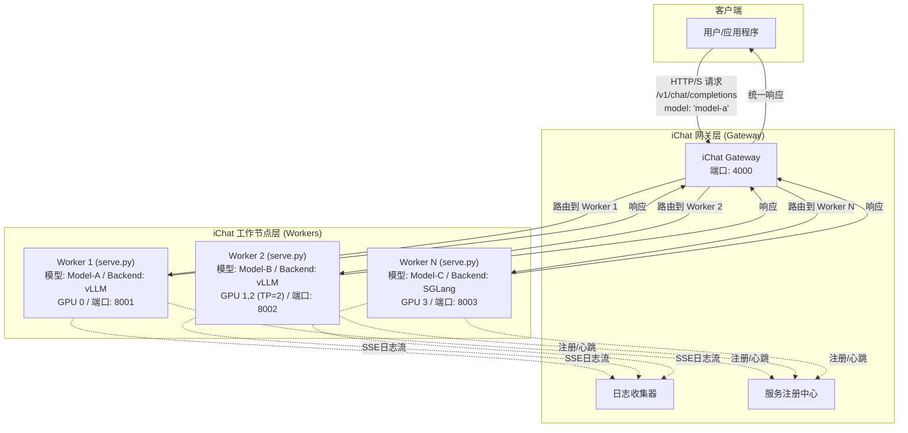

# iChat: 分离式网关与工作节点（Worker）推理服务框架

iChat 是一个专为大型语言模型（LLM）设计的高性能、可扩展的推理服务框架。它采用**网关（Gateway）与工作节点（Worker）分离**的现代化架构，通过统一的API网关（基于 `LiteLLM`）和多个独立的模型服务工作节点，实现了对异构推理后端（如vLLM, SGLang）的集中管理和动态路由。

## 核心特性

- **分离式架构**: 包含两大组件：`iChat Gateway` 负责请求路由、负载均衡和统一API入口；`iChat Worker` 负责加载和运行单个模型实例。
- **统一API网关**: 客户端只需与Gateway交互，即可访问所有后端模型服务，无需关心其具体部署位置和端口。
- **多引擎支持**: Worker节点可独立选择`vLLM`或`SGLang`作为推理引擎，并通过Gateway进行统一管理。
- **动态模型路由**: Gateway根据配置文件动态地将请求路由到指定的Worker，轻松实现模型的增、删、改，无需重启服务。
- **灵活部署**: 支持从单机单卡到多机多卡的任意复杂部署场景。Worker节点可以灵活分布，充分利用硬件资源。
- **混合部署模式**: Gateway可同时管理通过配置文件启动的Worker，并接受外部Worker的动态注册。两种方式无缝集成，提供极致的部署灵活性。
- **非侵入式设计**: Worker与底层推理引擎完全解耦，集成新引擎无需修改核心代码。
- **资源精细化控制**: 通过 `CUDA_VISIBLE_DEVICES` 环境变量，可为每个Worker实例精确分配物理GPU。
- **参数透传**: 保留对各引擎特定参数的直接访问能力，实现高级定制化。
- **自动服务发现**: Worker可自动向Gateway注册并定期发送心跳，实现动态服务发现。
- **集中式日志管理**: Worker通过SSE实时流式传输日志到Gateway，实现集中式日志收集与监控。

## 系统架构

iChat架构将系统拆分为两个核心部分：iChat Gateway和iChat Worker。Gateway作为系统的单一流量入口，负责接收所有客户端请求，并根据配置的路由规则，智能地将请求转发给后端相应的Worker。每个Worker是一个独立的`serve.py`实例，它加载一个模型并运行在一个或多个GPU上。

这种设计将网络路由与模型计算彻底分离，极大地提升了系统的灵活性、可维护性和扩展性。



## 项目结构

```
docker-iei/ichat/
├── README.md            # 项目文档
├── gateway.py           # iChat Gateway 入口
├── serve.py             # Worker 入口
├── config.yaml.example  # Gateway 配置文件示例
├── doc                  # 产品设计文档
├── backends/             # 推理引擎的抽象和实现
│   ├── __init__.py
│   ├── base.py          # 基础引擎抽象类
│   ├── vllm_backend.py   # vLLM引擎实现
│   └── sglang_backend.py # SGLang引擎实现
├── config/              # 配置相关
│   ├── __init__.py
│   └── args.py          # Worker参数处理和转换
├── utils/               # 工具函数
│   ├── __init__.py
│   ├── common.py        # 通用工具函数
│   └── logger.py        # 日志处理模块
└── monitor/             # 监控和服务发现
    ├── __init__.py
    ├── registry.py      # 服务注册中心
    └── heartbeat.py     # 心跳检测机制
```

## 设计原则

iChat的开发遵循以下核心原则：

1.  **关注点分离**: Gateway负责网络路由和管理，Worker专注于模型推理。各组件职责清晰，易于独立开发和维护。
2.  **扩展性优先**: 通过配置文件驱动的动态路由机制，可以轻松地水平扩展Worker节点，以支持更多模型或提供更高吞吐量。
3.  **引擎解耦**: Worker与推理引擎（如vLLM, SGLang）完全解耦，方便未来快速扩展支持新的推理引擎。
4.  **vLLM为默认引擎**: Worker默认采用vLLM，用户可通过`--backend`参数显式指定。
5.  **统一参数标准**: Worker的核心参数以vLLM为基准（snake_case），iChat内部会自动映射到其他引擎的格式。
6.  **设计驱动开发**: 所有重大架构变更和功能开发都首先在`README.md`中进行清晰的设计和规划。
7.  **集中式管理**: Gateway作为中心控制点，可以集中管理所有Worker的生命周期和资源分配。
8.  **自愈能力**: 通过心跳机制，系统能够自动检测和处理Worker节点故障。

## 功能状态

| 模块 | 状态 | 说明 |
|------|------|------|
| **Gateway** | 待开发 | API网关，基于LiteLLM，负责请求路由 |
| **Worker (`serve.py`)** | 待开发 | 负责加载并运行单个模型实例 |
| **服务注册与发现** | 待开发 | Worker向Gateway注册并发送心跳的机制 |
| **日志流传输** | 待开发 | Worker通过SSE向Gateway传输日志 |
| **Worker生命周期管理** | 待开发 | Gateway管理Worker的启动、监控和关闭 |
| 参数统一处理 | 待开发 | Worker的命令行参数解析与转换 |
| vLLM引擎适配 | 待开发 | vLLM推理引擎在Worker中的集成 |
| SGLang引擎适配 | 待开发 | SGLang推理引擎在Worker中的集成 |
| 手动多模型部署 | 待开发 | 通过启动多个Worker实例并由Gateway管理实现 |
| 分布式推理 | 待开发 | Worker支持单机/多机分布式。多机模式需手动建立Ray集群。|
| 多模态支持 | 待开发 | 图像、音频等多模态能力 |
| Embedding支持 | 待开发 | 文本嵌入模型支持 |
| Rerank支持 | 待开发 | 重排模型支持 |


## 使用说明

iChat采用统一的混合部署模型，启动Gateway后，可以通过多种方式部署和连接Worker。

### 步骤1：配置并启动Gateway

首先，启动Gateway服务，它将作为系统的中央控制点和统一API入口。

**1. 创建配置文件**

创建一个`config.yaml`文件，定义Gateway的行为以及它需要管理的Worker和外部路由。

**`config.yaml` 示例:**
```yaml
# Gateway服务配置
server_settings:
  host: 0.0.0.0
  port: 4000
  log_level: info

# Gateway自动管理的Worker配置
# Gateway会根据此列表自动启动和管理Worker进程
managed_workers:
  - model_name: qwen-7b-chat
    model_path: /path/to/qwen-7b-chat
    backend: vllm
    gpu_ids: [0]
    port: 8001
    heartbeat_interval: 3
    tensor_parallel_size: 1
    gpu_memory_utilization: 0.9
    
  - model_name: qwen-14b-chat
    model_path: /path/to/qwen-14b-chat
    backend: vllm
    gpu_ids: [1, 2]
    port: 8002
    heartbeat_interval: 3
    tensor_parallel_size: 2

# LiteLLM设置
litellm_settings:
  drop_params: True
```

**2. 启动Gateway**

使用以下命令启动Gateway。Gateway会读取配置文件，自动启动`managed_workers`中定义的Worker，并监听来自外部Worker的注册请求。

```bash
python gateway.py --config config.yaml
```

### 步骤2：部署Worker

您可以根据需求，选择以下一种或多种方式来部署模型服务。

#### 方式一：由Gateway自动管理

如果您希望Gateway为您管理Worker的生命周期（启动、监控、重启），只需在`config.yaml`的`managed_workers`部分定义好Worker即可。Gateway启动时会自动拉起这些服务。此方式适合需要集中管理和部署的场景。

#### 方式二：手动启动Worker并动态注册

在任何可以访问Gateway的机器上，您都可以手动启动Worker。Worker会自动向Gateway注册自己，并纳入Gateway的路由表中。此方式适合分布式部署或需要手动精细控制Worker启动的场景。

```bash
# Worker 1: 在GPU 0上部署model-a
CUDA_VISIBLE_DEVICES=0 python serve.py \
  --model /path/to/model_A \
  --port 8001 \
  --backend vllm \
  --gateway-address http://<GATEWAY_HOST>:4000 \
  --model-name model-a-dynamic

# Worker 2: 在GPU 1,2上部署large-model-b
CUDA_VISIBLE_DEVICES=1,2 python serve.py \
  --model /path/to/large_model_B \
  --port 8002 \
  --tensor-parallel-size 2 \
  --gateway-address http://<GATEWAY_HOST>:4000 \
  --model-name large-model-b-dynamic
```
*请注意：`--gateway`参数已更新为`--gateway-address`以提高清晰度。*

每个Worker启动后会：
1. 向Gateway的`/register`接口发送注册请求。
2. 定期发送心跳以表明自己处于活动状态。
3. 通过SSE接口实时流式传输日志到Gateway。

### 步骤3：发送请求

无论采用哪种部署方式，客户端都只需与Gateway交互。所有请求都应发送到Gateway的地址（例如`http://localhost:4000`）。

```bash
curl http://localhost:4000/v1/chat/completions \
  -H "Content-Type: application/json" \
  -d '{
    "model": "qwen-14b-chat",
    "messages": [
      {"role": "user", "content": "你好"}
    ]
  }'
```

Gateway会根据请求中的`model`字段，查询其服务注册表（包含所有自动管理的和动态注册的路由），然后将请求路由到相应的Worker。

## API 规范

iChat 的 API 分为两层：**Gateway API** 和 **Worker API**。客户端和管理员与 Gateway 交互，Gateway 与 Worker 交互。

```
+----------+      +------------------+      +---------------+
|          |----->|                  |----->|               |
|  Client  |      |  iChat Gateway   |      |  iChat Worker |
|          |<-----|                  |<-----|               |
+----------+      +------------------+      +---------------+
     ^                     ^
     |                     |
     +------(Admin)--------+
```

### 1. iChat Worker API (`serve.py`)

Worker 是实际的模型服务实例，其 API 主要由 Gateway 调用。

#### a. 数据平面 API (OpenAI 标准兼容)

Worker 包装了底层推理引擎（如 vLLM, SGLang），并向上层（Gateway）暴露标准的 OpenAI API 接口。

- `POST /v1/chat/completions`: 接收聊天补全请求。Gateway 会将客户端的请求直接转发至此。
- `POST /v1/completions`: 接收文本补全请求（传统接口）。
- `POST /v1/embeddings`: 接收文本嵌入请求。
- `GET /v1/models`: 返回此 Worker 加载的模型的详细信息。

#### b. 控制平面 API

这些接口供 Gateway 用于监控和管理 Worker。

- `GET /health`
  - **功能**: 健康检查接口。Gateway 使用此接口进行存活性和就绪性探测，确保 Worker 可以接收流量。
  - **响应**: `{"status": "ok"}`
- `GET /metrics`
  - **功能**: 暴露 Prometheus 格式的性能指标。可用于监控推理延迟、吞吐量、GPU 使用率等。
- `GET /logs/stream`
  - **功能**: 通过 Server-Sent Events (SSE) 向上游（Gateway）提供实时日志流。Gateway 连接此端点以实现集中式日志收集。

### 2. iChat Gateway API

Gateway 是整个系统的统一入口，为客户端和管理员提供服务。

#### a. 数据平面 API (OpenAI 兼容)

Gateway 聚合了所有 Worker 的能力，并提供一个统一的 OpenAI 兼容入口。

- `POST /v1/chat/completions`: 接收客户端的聊天补全请求，并根据 `model` 字段路由到合适的 Worker。
- `POST /v1/completions`: (传统接口) 接收文本补全请求并路由。
- `POST /v1/embeddings`: 接收文本嵌入请求并路由。
- `GET /v1/models`: 聚合所有已注册的、健康的 Worker 的模型信息，并返回一个统一的模型列表。
- `GET /v1/models/{model_name}`: 获取特定模型的详细信息。

#### b. 控制平面 API

控制平面 API 分为两部分：供 Worker 注册的内部接口和供管理员使用的管理接口。

##### i. Worker-Gateway 交互接口

这些接口由 Worker 主动调用，用于服务发现和状态上报。

- `POST /v1/workers/heartbeat`
  - **功能**: Worker 启动后，定期向 Gateway 发送心跳。此接口同时处理 **首次注册** 和 **后续心跳**。
  - **模式**: 采用 "upsert" 逻辑。如果 `worker_id` 首次出现，则视为注册；如果已存在，则更新其状态。
  - **请求体**: 包含 Worker 的完整元数据，如 `worker_id` (由 Worker 自行生成), `model_name`, `backend`, `host`, `port`, `model_path` 等。
  - **设计理念**: 简化 Worker 实现，无需区分注册和心跳流程。

- `GET /v1/logs/stream/{worker_id}`
  - **功能**: Worker 通过 SSE (Server-Sent Events) 将日志实时流式传输到 Gateway，以实现集中式日志管理。

##### ii. 管理员接口

这些接口用于监控和管理整个 iChat 集群。

- `GET /v1/admin/workers`
  - **功能**: 列出所有已注册的 Worker（包括由 Gateway 管理的和动态注册的），并显示其状态（如 `healthy`, `unhealthy`）、模型、地址等信息。

- `GET /v1/admin/workers/{worker_id}`
  - **功能**: 获取指定 Worker 的详细信息，包括元数据和健康状态。

- `POST /v1/admin/workers/launch`
  - **功能**: 动态启动一个新的 Worker 进程。此功能适用于通过 Gateway 按需扩展 Worker 的场景。
  - **请求体**: 包含启动 Worker 所需的完整配置，如 `model_name`, `model_path`, `backend`, `host`, `port`, `gpu_ids`, `heartbeat_interval` 等。

- `DELETE /v1/admin/workers/{worker_id}`
  - **功能**: 停止并移除一个由 Gateway 启动的 Worker 实例。

- `GET /v1/admin/cluster/status`
  - **功能**: 获取整个 iChat 集群的总体状态，包括 Gateway 状态、资源使用情况和已注册 Worker 概览。

- `GET /v1/admin/cluster/version`
  - **功能**: 获取 iChat Gateway 的版本信息。


## 贡献

欢迎贡献代码、报告问题或提出改进建议:

1. Fork项目仓库
2. 创建功能分支: `git checkout -b feature/new-feature`
3. 提交更改: `git commit -m 'Add new feature'`
4. 推送分支: `git push origin feature/new-feature`
5. 提交合并请求

## 许可证

本项目采用MIT许可证 - 详见LICENSE文件
